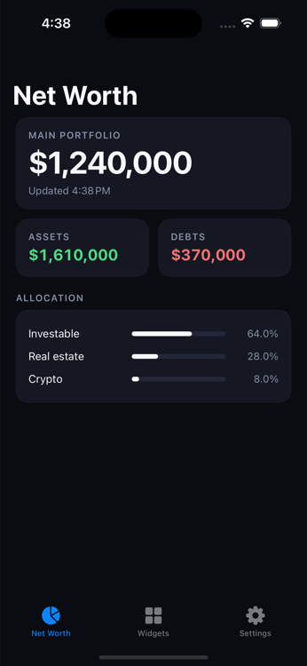
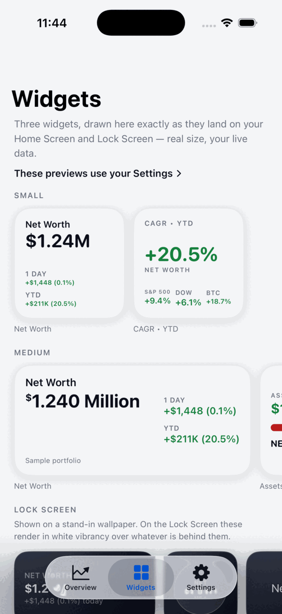
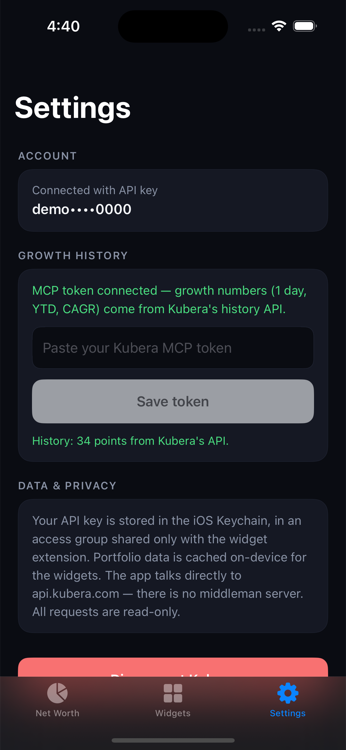

# Kubera Mobile

A native iOS app (SwiftUI + WidgetKit) that puts your [Kubera](https://www.kubera.com)
net worth on your Home Screen.

> **Unofficial.** This is an independent, personal project with no affiliation to or
> endorsement by Kubera. It talks to Kubera's API with credentials you create in your
> own account, and all requests are read-only. "Kubera" and the Kubera logo are
> trademarks of their owner.

## What you get

| Widget | Sizes | Shows |
| --- | --- | --- |
| **Net Worth Trends** | small, medium, Lock Screen (inline / circular / rectangular) | Net worth with 1-day, 1-year, and YTD change |
| **CAGR • YTD** | small | Year-to-date net worth growth next to the S&P 500, Dow Jones, and Bitcoin (market data via Yahoo Finance's public chart API) |
| **Assets vs Debts** | medium | Asset and debt totals with a ratio bar |

## Screenshots

| Net Worth | Widgets | Settings |
| --- | --- | --- |
|  |  |  |

*Screenshots show sample data.*

In the app:

- **Connect with a Kubera API key** (Settings → API in Kubera web) — validated against
  the live API, stored only on-device.
- **Net Worth dashboard** — net worth, assets/debts, allocation, pull-to-refresh,
  portfolio switcher for multi-portfolio accounts.
- **Widgets tab** — live previews of each widget rendered with your data, and an
  "Add widgets" walkthrough.
- **Settings** — Face ID lock (on by default), privacy mode (mask amounts), compact
  numbers ($1.24M vs $1,240,000), widget portfolio selection, disconnect.
- **Face ID lock** — the app locks when you leave it (30-second grace period) and
  unlocks with Face ID / Touch ID / passcode.

## How data flows

```
┌─────────────┐   HMAC-signed GET    ┌──────────────────┐
│ SwiftUI app │ ───────────────────▶ │  api.kubera.com  │
└──────┬──────┘                      └──────────────────┘
       │ creds → shared Keychain group             ▲
       │ snapshot + settings → App Group defaults  │
       ▼                                           │
┌─────────────────────────────┐    independent     │
│ Keychain (access group)     │    refresh (30m)   │
│ App Group NSUserDefaults    │ ◀──────────────────┤
└──────┬──────────────────────┘                    │
       ▼ reads                                     │
┌─────────────────────────────┐                    │
│ WidgetKit extension         │ ───────────────────┘
└─────────────────────────────┘
```

- Requests are signed with `HMAC-SHA256(secret, apiKey + timestamp + METHOD + path)`,
  implemented once in `Shared/KuberaAPI.swift`, which is compiled into both the app and
  the widget extension — so widgets refresh themselves even when the app hasn't been
  opened in days.
- Credentials are stored in the iOS Keychain (accessible after first unlock) inside a
  keychain access group shared with the widget extension. The shared group is listed
  first in both targets' `keychain-access-groups`, so writes default into it — no
  team-ID string is needed at runtime. Only the non-sensitive-ish display snapshot and
  settings go through App Group `NSUserDefaults`.
- Opening the app (or tapping "Update widget data now") refreshes the shared snapshot
  and reloads all widget timelines immediately.
- All calls are read-only. There is no backend server — the device talks to Kubera directly.
- iOS budgets widget refreshes (roughly 40–70/day), so timelines ask for a refresh every
  ~30 minutes and fall back to the cached snapshot on network failure.

## Project layout

```
project.yml     XcodeGen spec — the .xcodeproj is generated, edit this instead
App/            SwiftUI app: KuberaWidgetsApp, AppStore (@Observable), Views/
Shared/         Compiled into BOTH targets:
  Shared.swift    App Group + Keychain storage, shared models
  KuberaAPI.swift HMAC-signed Kubera client
  Format.swift    currency/date formatting + widget theme colors
Widgets/        WidgetKit extension: WidgetBundle, TimelineProvider, widget views
```

## Building

Requires Xcode 16+ and an Apple Developer account (App Groups need one).

```
brew install xcodegen   # once
./dev                   # build, install, launch on the simulator, stream logs
```

`./dev` reuses whatever simulator is booted (or boots an iPhone 15 Pro; override
with `SIM_NAME="iPhone 15" ./dev`) and regenerates the Xcode project whenever
`project.yml` changed. For device builds or debugging, open
`KuberaWidgets.xcodeproj` and hit ⌘R. Sign in with your Kubera API key + secret,
then add widgets from the iOS widget gallery.

**Forking?** Change these to your own before building: `DEVELOPMENT_TEAM` in
`project.yml` (and `teamID` in `ExportOptions.plist`), the `com.kubera.mobile`
bundle identifiers, and the App Group / Keychain group ids in `project.yml`,
both `.entitlements` files, and `SharedKeys.appGroup` in `Shared/Shared.swift`.

## Notes & future work

- Possible next widgets: net worth sparkline (needs history endpoint), Live Activity
  for market hours, per-widget portfolio selection via AppIntents configuration.
- The cached snapshot in App Group defaults contains portfolio values (needed for
  offline widget rendering); moving it into the Keychain too would be maximal
  hardening at the cost of some complexity.
- The app was originally Expo/React Native with a native widget extension; it was
  migrated to pure Swift in July 2026. On-disk formats (Keychain item, App Group keys)
  are unchanged, so updates from the Expo build keep credentials and settings.
