# Kubera Mobile

A native iOS app and Home Screen widget suite for [Kubera](https://www.kubera.com),
written in SwiftUI and WidgetKit. It reads your portfolio straight from Kubera's own
API using credentials you create in your own account — there is no server in between.

> **Unofficial.** This is an independent, community-built project with no affiliation
> to, sponsorship by, or endorsement from Kubera. It talks to Kubera's API with
> credentials you create yourself, and every request it makes is read-only.
> "Kubera" and the Kubera logo are trademarks of their owner.

## Screenshots

Your whole net worth, one scroll, no chrome in the way. Drag the chart and the
headline figure follows your finger.

| Overview | Widgets | Settings |
| --- | --- | --- |
| 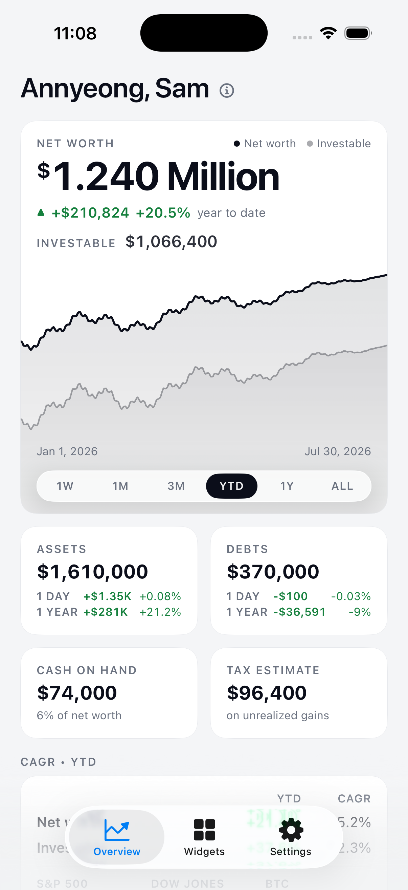 | 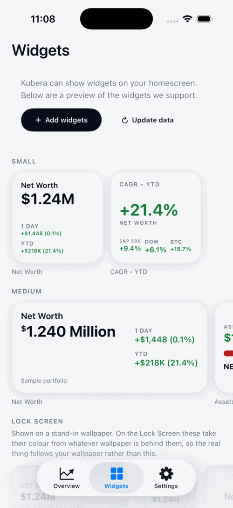 | 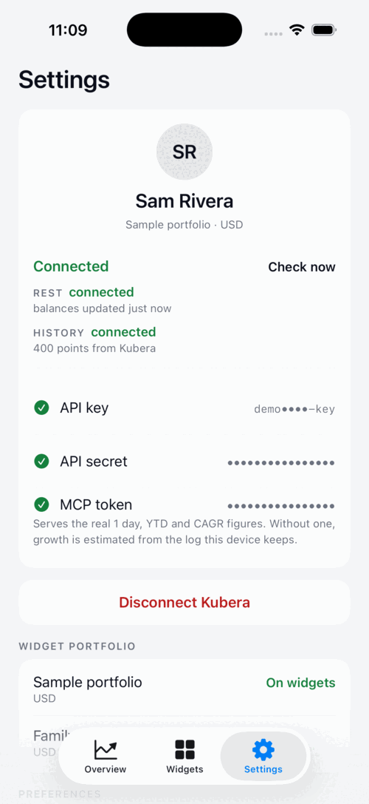 |
| 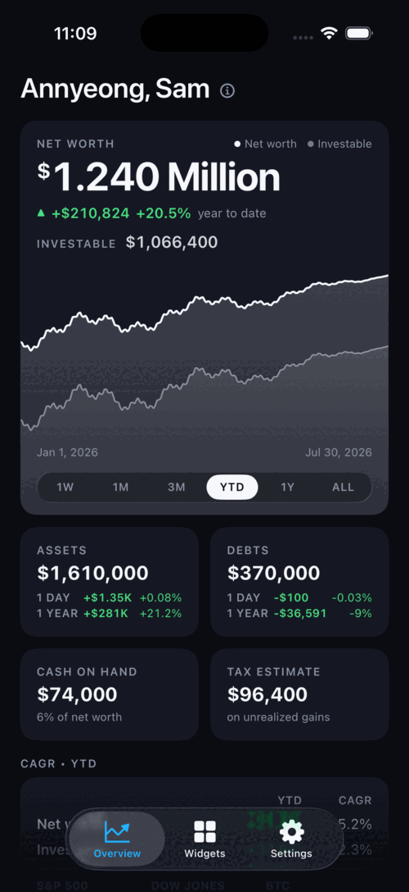 | 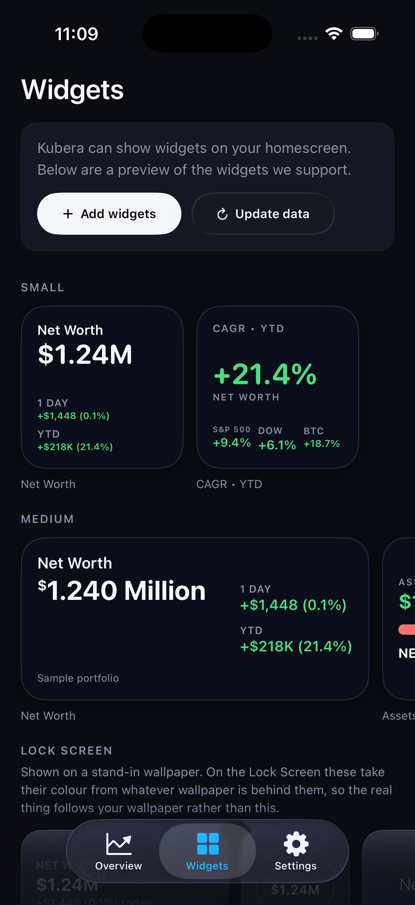 | 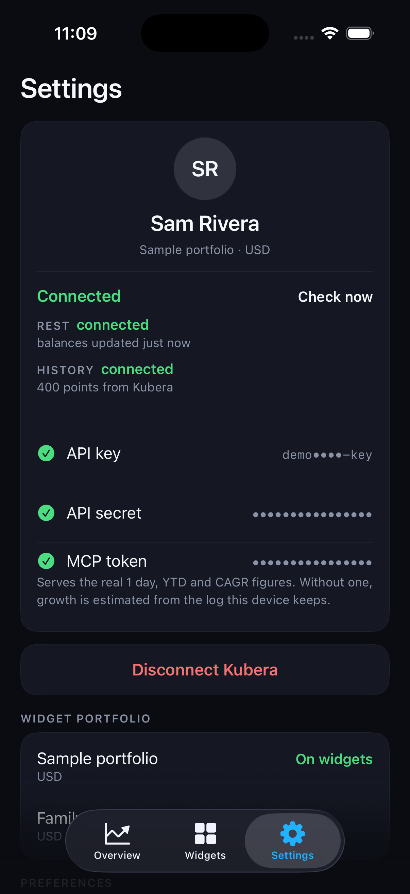 |

Keep scrolling and the dashboard keeps going: growth against the S&P 500, Dow and
Bitcoin, allocation as one bar, and your holdings grouped the way you filed them
in Kubera. The Widgets tab previews every widget at its **true point size** —
those are the real widget views, not mockups, so what you see is the text size
you will get. Lock Screen accessories are shown on a stand-in wallpaper, because
that is the only honest way to preview something that draws itself from whatever
is behind it.

| Growth, allocation, composition | Lock Screen widgets | First run |
| --- | --- | --- |
| 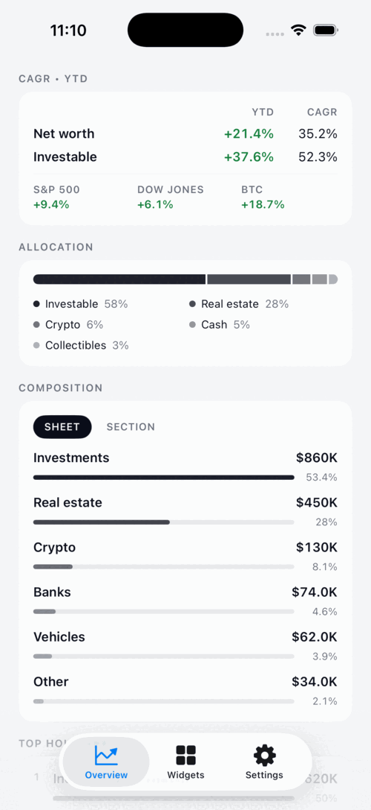 | 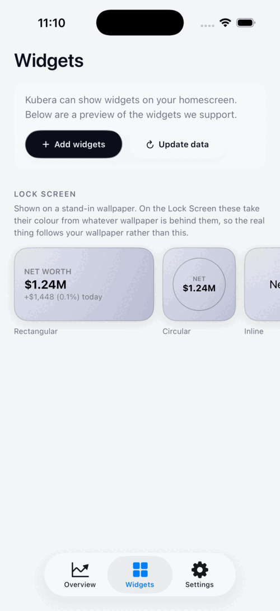 | 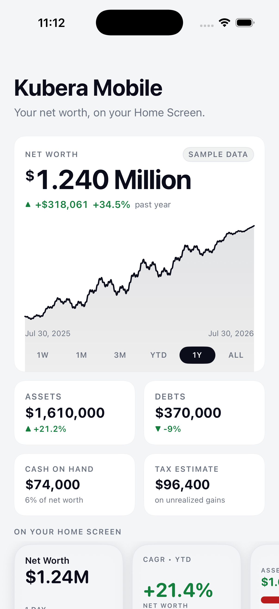 |
| 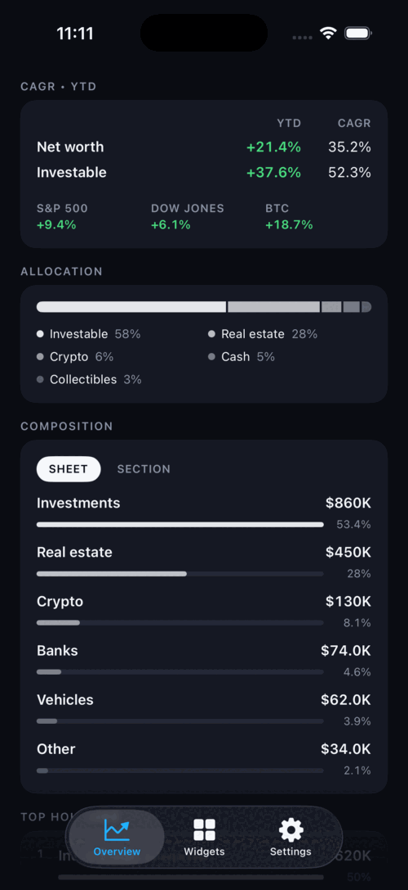 | 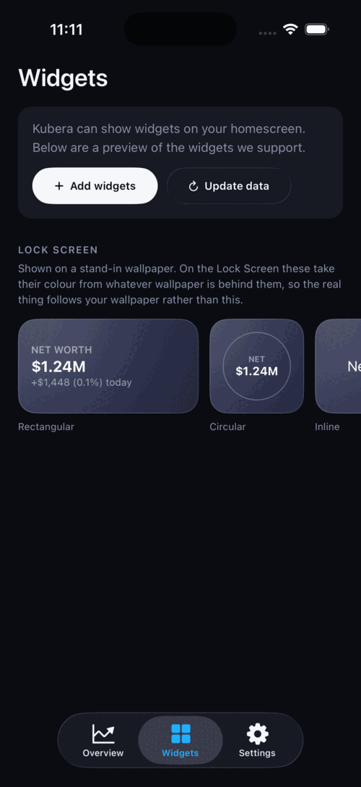 | 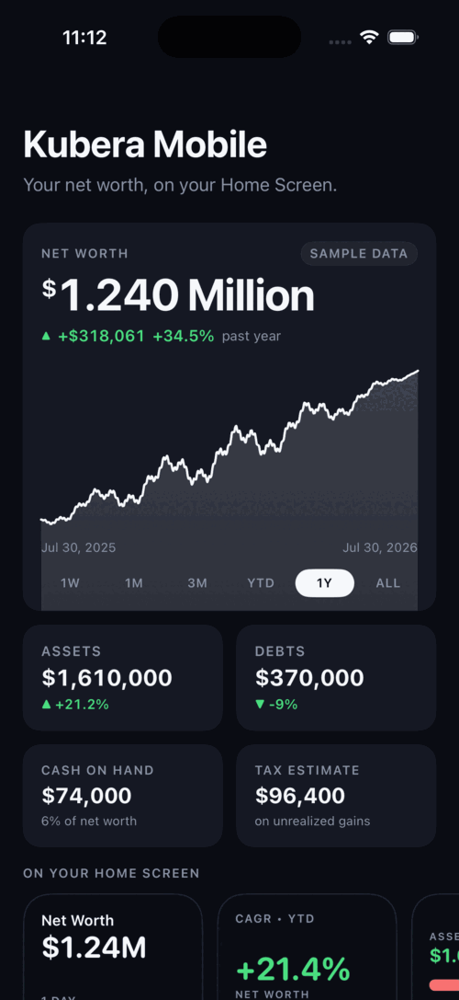 |

Every figure above is invented. These are captured from the built-in demo mode,
which renders the entire app against a synthetic portfolio — no Kubera account, no
subscription, no credentials. You can run it in about a minute: see [Try it
without a Kubera account](#try-it-without-a-kubera-account).

## Features

### The Overview

One scrollable dashboard, in the order you actually look things up.

- **Net worth as the headline.** One hero figure with the change beside it, not four
  competing big numbers. The Kubera-style "$1.240 Million" spelling on the widget,
  full grouping in the app.
- **A chart you can drag.** A Swift Charts area chart bleeding to the card's edges,
  with `1W 1M 3M YTD 1Y ALL` range pills (YTD by default). Drag across it and the
  hero figure and its delta retarget to the day under your finger. A hole in
  Kubera's history breaks the line rather than inventing a slope across it. The
  chart is exposed to VoiceOver as a readable series.
- **Investable, drawn alongside.** When the history carries it, the liquid slice is
  plotted on the same axis as net worth, so the gap between the two is readable. The
  figure is shown next to net worth only while it is recent enough to still be true.
- **Assets and debts**, each with its own 1 DAY and 1 YEAR lines. "Unknown" stays
  blank instead of rendering as 0%.
- **Cash on hand and the tax estimate.** Cash is captioned with its share of net
  worth; the tax figure says what it is modelled on, because it is an estimate on
  unrealized gains rather than a fact. Either card hides itself when Kubera has no
  value for it.
- **CAGR • YTD against the market.** Your net worth's year-to-date growth and its
  compound annual rate, next to the S&P 500, Dow Jones and Bitcoin over the same
  period (benchmark closes come from Yahoo Finance's public chart API). CAGR is
  withheld until the series spans a full year — annualizing three months of data
  produces a rate nobody's portfolio will hold.
- **Allocation** as a single segmented bar with a legend, rather than a column of
  percentages.
- **Composition**, grouped by Kubera sheet or by section, ranked, with the long tail
  folded into one "Other" row. Assets you have not filed land in "Unsorted" rather
  than disappearing.
- **Top holdings**, ranked, each with a share bar.
- **Pull to refresh**, and a footer saying when the numbers were last updated.

### Widgets

Three widgets, all driven by the same cached snapshot the app writes, so they keep
refreshing on their own even if you have not opened the app in days.

| Widget | Families | Shows |
| --- | --- | --- |
| **Net Worth** | small, medium, Lock Screen inline / circular / rectangular | Net worth, with 1 DAY and YTD change on the Home Screen families and today's change on the rectangular accessory |
| **CAGR • YTD** | small | Year-to-date net worth growth beside the S&P 500, Dow Jones and Bitcoin — percentages only, no amounts |
| **Assets vs Debts** | medium | Asset and debt totals with a ratio bar and the net figure |

Widgets follow the Home Screen's light or dark appearance rather than forcing dark,
and the green and red are darker in light mode because the bright dark-mode green is
unreadable on white. Tapping a widget opens the app and scrolls the Overview to the
module that widget was showing.

The **Widgets tab** in the app previews all of them at their true point size — the
real widget views, not mockups or screenshots — with the Lock Screen accessories
shown on a stand-in wallpaper. iOS exposes no API to open the Home Screen widget
gallery, so the "Add widgets" button walks you through the manual steps instead of
pretending otherwise.

### Everything else

- **Face ID lock**, on by default. The app locks on cold start and on returning from
  the background after a 30-second grace period, so app switching does not punish you
  with a prompt. Touch ID and the device passcode work as fallbacks, and a device with
  no passcode configured unlocks rather than bricking the app. First run is never
  gated — there is nothing to protect before you connect an account.
- **Privacy mode** masks every amount, in the app and on the Home Screen. Percentages
  stay visible: a ratio reveals no balance.
- **Compact numbers** switches between `$1.24M` and `$1,240,000`. A column of related
  figures picks one unit for the whole column, so a list never mixes `$130K` two rows
  above `$74,000`.
- **Multiple portfolios.** All portfolios on the account are listed; you pick which
  one the widgets read, and switching updates the dashboard.
- **A greeting that changes.** The Overview's heading is "Hej, Kenneth" one visit and
  "Good afternoon, Kenneth" the next, rotating through hellos in eighteen languages
  plus English time-of-day forms. It is picked deterministically from the day and
  hour, so it changes as the day goes on but never flickers between two renders. An
  unfamiliar hello carries a quiet marker you can tap for the translation. (The app's
  own interface is English only.)
- **Dynamic Type** throughout, including layouts that restructure at accessibility
  sizes rather than only growing. The hero figure compacts at those sizes and keeps
  the full, unabbreviated number in its VoiceOver value.

## Requirements

From `project.yml`, which is the source of truth:

- **iOS 17.0 or later**, iPhone only, portrait only.
- **Xcode 26 or newer.** The deployment target is iOS 17, but the app builds against
  the iOS 26 SDK: Liquid Glass on the controls layer, concentric corner radii and the
  minimizing tab bar are all behind `#available(iOS 26, *)` and will not compile
  without that SDK. On earlier iOS versions those paths fall back to materials and
  fixed corner radii.
- **[XcodeGen](https://github.com/yonaskolb/XcodeGen).** The `.xcodeproj` is generated
  from `project.yml`.
- **An Apple Developer account** for anything beyond the simulator — the App Group and
  the shared Keychain access group are entitlements, and entitlements need a team.

## Getting started

```sh
git clone https://github.com/auchenberg/kubera-mobile.git
cd kubera-mobile
brew install xcodegen        # once
./dev
```

`./dev` is this repo's `npm run dev`. It regenerates the Xcode project (sources are
globbed, so adding a file changes the project without touching `project.yml`), reuses
whatever simulator is already booted or boots an iPhone 17 Pro, builds, installs,
launches, and streams the app's console until you press Ctrl+C. Override the
simulator with `SIM_NAME="iPhone 17" ./dev`.

To work in Xcode instead, run `xcodegen` and open `KuberaWidgets.xcodeproj`. Tests
run with ⌘U; the test bundle needs no host app.

### Try it without a Kubera account

The single most useful thing if you are just looking, or contributing UI changes:
the app can render every screen against a synthetic portfolio with no Kubera
account, no subscription and no credentials at all.

```sh
./dev                                                    # build and install; Ctrl+C to stop the logs
xcrun simctl launch booted com.kubera.mobile -KuberaDemoMode

# open straight onto a tab, which is how the screenshots above are taken:
xcrun simctl launch booted com.kubera.mobile -KuberaDemoMode -KuberaInitialTab widgets
#                                                            -KuberaInitialTab settings
```

Demo mode is debug-only and launch-argument-gated, so it cannot be reached from a
release build or by any action inside the app. It reads `Shared/DemoData.swift`,
talks to nothing, and writes nothing — not to the Keychain, not to the shared
container — so a demo figure can never surface later as if it were your own. The
Face ID lock is off in a demo run, since a simulator with no enrolled biometrics
would otherwise open on a passcode sheet.

The demo portfolio is a fictional ~$1.2M net worth over 400 days of generated
history. The curve comes from the day index through `sin`, so it draws the same
shape on every launch and the tests have something stable to assert against.

## Connecting a real account

You need three values, all from the same page in Kubera on the web:
**[Account settings → API access](https://app.kubera.com/networth#modal=account_settings&tab=api_access)**.
"Create New API Key" gives you the first two; "Create MCP Token" on the same page
gives you the third.

| Credential | What it unlocks |
| --- | --- |
| **API key** | Net worth, assets, debts, allocation, holdings — everything the REST snapshot carries |
| **API secret** | Signs those requests. Kubera shows it once, at creation |
| **MCP token** | History, and everything derived from it |

**The MCP token is required, not optional.** Kubera serves portfolio history only
through its MCP endpoint, which will not accept the REST API key — asking it with
one is rejected outright. Without the token there is no real 1 day, YTD or CAGR
figure, and growth falls back to an on-device log that records one point per day as
the app and the widgets refresh. That log starts empty on the day you install, so
YTD and CAGR stay blank for a long time. The MCP token is also the only source for
cash on hand, the tax estimate, the investable total, the sheet/section hierarchy the
composition module groups by, and your account name for the greeting and the Settings
header.

The connect screen validates the key and secret against the live API before storing
them, so a bad paste cannot replace a working key. The MCP token is validated by
actually asking Kubera for history — the only honest check, since a well-formed token
can still be rejected. If only the token fails, the key and secret are still saved and
Settings says exactly what happened.

Changing credentials later means disconnecting and reconnecting; the confirmation
dialog says so outright. Disconnecting removes all three credentials from the device
along with the cached balances and the on-device history log.

## Privacy and security

Every claim here is in the code; the file is named beside it.

- **Credentials live in the iOS Keychain** (`Shared/Shared.swift`), written with
  `kSecAttrAccessibleAfterFirstUnlock` so a widget can read them to refresh while the
  device is locked. They sit in a Keychain access group,
  `$(AppIdentifierPrefix)com.kubera.mobile.shared`, which is the only group listed in
  either target's entitlements — the app and its widget extension, nothing else.
- **Cached data stays on the device.** The snapshot, trends, market benchmarks,
  portfolio detail, profile and history log go through an App Group
  (`group.com.kubera.mobile`) so the widget extension can render without a network
  call. That cache contains portfolio values; it is on-device only, and it is what
  makes offline widget rendering work. Moving it into the Keychain as well is an
  open idea in `specs/backlog.md`, not something done.
- **The device talks to Kubera directly.** `Shared/Kubera.swift` is the only file that
  opens a connection to `api.kubera.com`, over two transports: HMAC-SHA256-signed REST
  for balances, and the MCP endpoint for history. There is no backend of ours in
  between, and nothing is proxied.
- **Every request is read-only.** The REST client issues nothing but GETs, and the MCP
  client calls only `get_portfolio_history`, `get_portfolio`, `get_default_portfolio`
  and `get_profile`. Nothing is ever written to your Kubera account.
- **One other network dependency**, for honesty's sake: the market benchmarks come from
  Yahoo Finance's public chart API (`Shared/MarketComps.swift`). Those requests carry a
  ticker symbol and nothing else — no credentials, no portfolio data, no identifier.
- **Disconnecting really disconnects.** It clears the Keychain item, the cached
  snapshot, trends, detail, profile, and the on-device history log.

## Architecture

```
project.yml     XcodeGen spec — the .xcodeproj is generated, edit this instead
App/            SwiftUI app: KuberaWidgetsApp, AppStore (@Observable), AppLock, Views/
Shared/         Compiled into the app, the widget extension AND the test bundle:
  Kubera.swift    The whole API surface — REST + MCP transports, every decoder
  Shared.swift    Keychain + App Group storage, shared models
  WidgetViews.swift  The rendering half of every widget
  OverviewChart / OverviewModules / Trends / MarketComps / Format / Greeting / …
Widgets/        WidgetKit extension: bundle, TimelineProvider, widget configurations
Tests/          XCTest over Shared/ — no host app
specs/          Product and design specs, plus the backlog of what is still open
docs/           Screenshots and the app icon's design notes
```

Three things worth knowing:

- **`project.yml` is the source of truth.** Sources are globbed, so adding a file means
  re-running `xcodegen`, not editing a project file. Never hand-edit the `.xcodeproj`.
- **`Shared/` is compiled into every target**, which is why the app's widget previews
  are the real widget views rather than mockups that drift out of date.
- **The test bundle compiles `Tests/` + `Shared/` only** — no app target, no host app.
  That is *why* logic lives in `Shared/`: anything in `App/` is untestable by
  construction, so the chart maths, the trend arithmetic, the markdown parsers, the
  lock policy, the monogram initials and the greeting rotation all live in `Shared/`
  and have tests. Views stay layout.

### Forking

Change these to your own before building: `DEVELOPMENT_TEAM` in `project.yml` and
`teamID` in `ExportOptions.plist`; the `com.kubera.mobile*` bundle identifiers in
`project.yml`; the App Group and Keychain access group ids in both `.entitlements`
files and `SharedKeys.appGroup` in `Shared/Shared.swift`.

## Contributing

Issues and pull requests are welcome. A few things that will make a change land more
easily:

- Read `specs/backlog.md` first — it records what shipped, what is still open, and
  four design decisions that are the maintainer's to make.
- Behaviour changes want a test. If the logic is not in `Shared/`, it cannot have one.
- Run `xcodegen` after adding or removing a file, and commit the regenerated project.
- The demo mode above means you can develop and review UI changes without a Kubera
  subscription.

Everything in this repository is public, including the specs and the screenshots.
Keep it that way: no real credentials, no real balances. `Shared/DemoData.swift` is
deliberately synthetic and self-describing for that reason.

## Licence

MIT — see [LICENSE](LICENSE).
